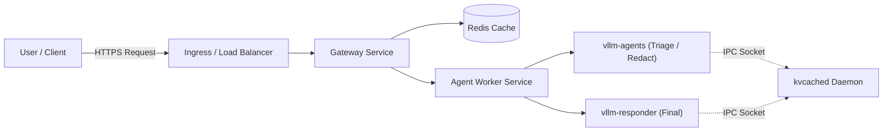

# Cost-Efficient LLM Serving Platform

[](https://github.com/savyasachi6/llm-serving-platform/actions)
[](https://www.python.org/downloads/release/python-3120/)
[](https://fastapi.tiangolo.com)
[](https://github.com/vllm-project/vllm)
[](https://www.docker.com/)
[](https://kubernetes.io/)
[](LICENSE)

## 🎯 Project Purpose
This repository provides a high-throughput, cost-efficient, caching-aware serving layer designed specifically for multi-agent LLM workflows. It serves as the intelligent bridge between client applications and underlying LLMs (like vLLM or Ollama).

## 💡 What Problem This Solves
Running multi-agent AI systems often leads to massive token overhead and GPU memory exhaustion. Standard architectures fail when multiple agents request overlapping context simultaneously. This system solves that by enforcing admission control, providing tenant-isolated caching, and abstracting the orchestration of complex AI tasks using a unique `kvcached` IPC memory-sharing daemon and dynamic LoRA hot-swapping.

## 🏗️ High-Level Architecture Summary
The system consists of an API Gateway, an Agent Worker for orchestration, a React frontend playground, a Redis cache, and two vLLM inference engines (`vllm-responder` and `vllm-agents`). A sidecar daemon called `kvcached` manages GPU memory pooling dynamically over a Unix IPC socket.

### How the System Works
1. **Client Request**: A user submits a prompt via the Playground UI or directly via the API Gateway.
2. **Gateway**: Checks Redis for an exact-match semantic cache (respecting tenant isolation). If a miss, routes to Agent Worker.
3. **Agent Worker**: Orchestrates a pipeline: Triage -> Redact -> Respond.
4. **kvcached Daemon**: Pre-allocates GPU VRAM and shares it via a Unix socket `/tmp/kvcached-ipc/kvcached.sock`.
5. **vLLM Engines**: Request memory from `kvcached`. `vllm-agents` hot-swaps LoRAs for Triage/Redact. `vllm-responder` generates the final output.

## 🖼️ Visual Architecture Diagram



## 🚀 Quick-Start Instructions

### Prerequisites
- Docker & Docker Compose
- NVIDIA GPU (if running full vLLM engines)
- Linux / WSL2 (for GPU support)

### Local Development Path
1. Copy the environment file: `cp .env.example .env`
2. Start the mock backend for fast dev: `USE_MOCK=True docker compose up -d`
3. Access Gateway at `http://localhost:8000/docs`

### Docker & Docker Compose Path
To run the full multi-engine pipeline locally using Docker Compose:
```bash
docker compose -f docker-compose.yml up -d --build
docker compose ps
```
> See our [Docker Guide](docs/docker-guide.md) for more info.

### Kubernetes Deployment Path
To deploy to a cluster or Minikube:
```bash
kubectl apply -k infra/kubernetes/base
kubectl get pods -n llm-serving
```
> See our [Kubernetes Guide](docs/kubernetes-guide.md) for details on scaling, resources, and IPC sockets.

## 🗂️ Documentation Navigation

| Topic | Link | Description |
|---|---|---|
| **Architecture** | [Architecture Overview](docs/architecture/overview.md) | High-level system design, request flow, and control plane. |
| **Multi-LoRA Serving** | [Multi-LoRA & Heterogeneous Serving](docs/architecture/multi_lora_and_heterogeneous_serving_explained.md) | Dynamic adapter hot-swapping and CUDA kernel internals. |
| **Frontend Playground** | [Playground UI Guide](docs/architecture/frontend_playground_and_kubernetes_guide.md) | Real-time React dashboard for customer support ticket assembly line. |
| **Local Setup & Docker** | [Docker Guide](docs/docker-guide.md) | Multi-stage builds, port mappings, named volumes, and bridge networks. |
| **Kubernetes** | [Kubernetes Deployment Guide](docs/kubernetes-guide.md) | Manifests, resource budgeting, DaemonSet IPC sockets, and HPA. |
| **Troubleshooting** | [Troubleshooting Guide](docs/troubleshooting.md) | Container exit codes, healthcheck timeouts, Pending pods, and PVCs. |
| **Configuration** | [Configuration Guide](docs/configuration.md) | Full environment variable matrix, secrets, and CoreDNS addressing. |
| **Security & Secrets** | [Security Threat Model](docs/security/threat_model.md) | Strict tenant cache isolation, log redaction, and prompt injection defense. |

## 🧭 Choose Your Path
- **I want to run the project locally**: Start with the [Docker Guide](docs/docker-guide.md).
- **I want to deploy the project**: Read the [Kubernetes Guide](docs/kubernetes-guide.md).
- **I want to explore the Playground UI**: Check the [Playground Guide](docs/architecture/frontend_playground_and_kubernetes_guide.md) or [apps/playground/README.md](apps/playground/README.md).
- **I am troubleshooting an issue**: Check the [Troubleshooting Guide](docs/troubleshooting.md).
- **I want to understand vLLM Memory Sharing**: View the [Interactive kvcached Explainer](docs/kvcached/index.html) (serve with `python scripts/build_kvcached_explainer.py --serve`).

## 📂 Repository Structure Guide
- `apps/gateway`: FastAPI ingress handling admission and caching.
- `apps/agent-worker`: Orchestrator for complex workflows.
- `infra/kubernetes/base`: Kustomize manifests for cluster deployment.
- `docs/`: Comprehensive guides and architecture diagrams.
- `docker-compose.yml`: Local multi-container orchestration.
