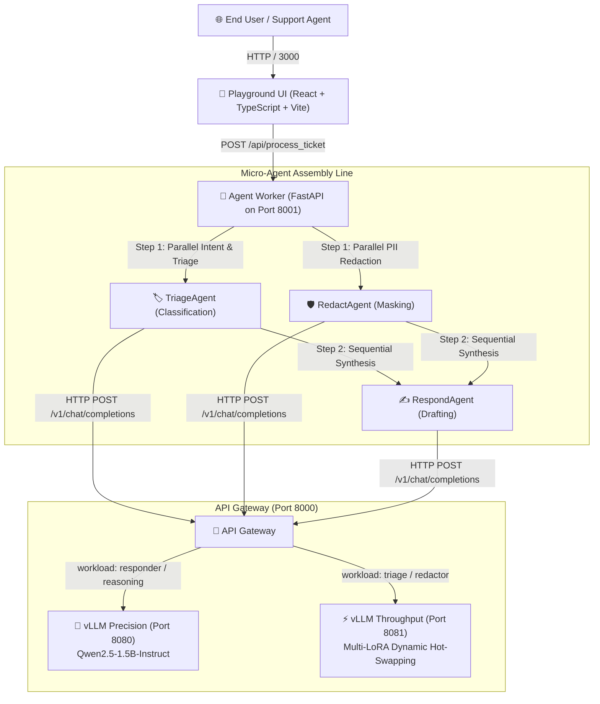

# 🎨 Frontend Playground & Kubernetes Architecture Guide

This document explains the **Playground UI**, how it integrates with the **Agent Worker** and **API Gateway**, and how to run and test it locally and inside **Kubernetes**.

---

## 🏛️ Full End-to-End System Architecture

The frontend provides an interactive, real-time control plane to submit customer tickets, visualize agent execution, and observe token generation across the heterogeneous inference engines.



---

## 💻 1. How the Playground UI is Configured

### 1.1 Architecture & Tech Stack
- **Framework**: React 18 + TypeScript + Vite.
- **Styling**: Sleek glassmorphism theme (`backdrop-filter: blur(16px)`), curated HSL indigo/violet gradients, responsive layout grid.
- **Dynamic Endpoints**: Supports `VITE_API_URL` environment variable to connect to local development ports or Kubernetes service DNS names.

### 1.2 Interactive Features
1. **Customer Support Ticket Input**: Textarea pre-loaded with representative test tickets containing PII (names, SSNs, credit cards, and billing queries).
2. **Triage Classification Badge**: Dynamic color-coded tags (`Billing` in red, `Technical` in blue, `General` in green).
3. **PII Redacted Ticket Display**: Monospace code box displaying redacted tokens (e.g. `[EMAIL]`, `[SSN]`, `[CREDIT_CARD]`) to guarantee tenant safety.
4. **Synthesized Reply Box**: Formatted response generated by the precision model using prefix-cached guidelines.

---

## ☸️ 2. Running in Kubernetes

In your Kubernetes cluster, the platform runs 5 distinct microservice deployments:

| Microservice | Cluster Deployment | Replicas | Internal DNS Endpoint | Exposed Localhost Port |
| :--- | :--- | :---: | :--- | :--- |
| **Playground UI** | `deployment/playground` | `1` | `http://playground:80` | `http://localhost:3000` |
| **API Gateway** | `deployment/gateway` | `3` | `http://gateway:80` | `http://localhost:8000` |
| **Agent Worker** | `deployment/agent-worker` | `3` | `http://agent-worker:8001` | `http://localhost:8001` |
| **vLLM Precision** | `deployment/vllm-responder` | `1` | `http://vllm-responder:8080` | `http://localhost:8080` |
| **vLLM Throughput** | `deployment/vllm-agents` | `1` | `http://vllm-agents:8080` | `http://localhost:8081` |

---

## 🔗 3. Complete URL Reference Table

| Service / App | Browser / API URL | Description |
| :--- | :--- | :--- |
| **🎨 Playground UI** | [**`http://localhost:3000`**](http://localhost:3000) | Interactive React dashboard to input support tickets and see real-time agent output. |
| **🚪 API Gateway Docs** | [**`http://localhost:8000/docs`**](http://localhost:8000/docs) | Interactive Swagger UI documentation for all Gateway endpoints. |
| **❤️ Gateway Health** | [**`http://localhost:8000/health`**](http://localhost:8000/health) | JSON status showing gateway and cache health. |
| **📊 Prometheus Metrics** | [**`http://localhost:8000/metrics`**](http://localhost:8000/metrics) | Real-time observability metrics (cache hit ratios, latencies, token counts). |
| **🤖 Agent Worker Docs** | [**`http://localhost:8001/docs`**](http://localhost:8001/docs) | Swagger docs for the multi-agent assembly line API (`/api/process_ticket`). |
| **🧠 vLLM Precision** | [**`http://localhost:8080/v1/models`**](http://localhost:8080/v1/models) | JSON list showing the loaded `Qwen2.5-1.5B-Instruct` model. |
| **⚡ vLLM Throughput (Multi-LoRA)** | [**`http://localhost:8081/v1/models`**](http://localhost:8081/v1/models) | JSON list showing the base model and both active adapters (`reasoning-lora` & `reflection-lora`). |

---

## 🧪 4. Step-by-Step Testing & Verification

### Mode A: Testing in Local Kubernetes (KinD)
```powershell
# 1. Forward Kubernetes services to Windows localhost
kubectl port-forward svc/playground 3000:80
kubectl port-forward svc/gateway 8000:80
kubectl port-forward svc/agent-worker 8001:8001

# 2. Open browser at http://localhost:3000 and click "Run Agent Pipeline"
```

### Mode B: Testing in Direct Local Development
```powershell
# 1. Start API Gateway (Port 8000)
$env:PYTHONPATH="packages/common/src;packages/contracts/src;packages/prompt-engine/src;packages/retrieval/src;packages/evaluation/src;apps/gateway" ; .\.venv\Scripts\python -m uvicorn app.main:app --port 8000

# 2. Start Agent Worker API (Port 8001)
$env:PYTHONPATH="packages/common/src;packages/contracts/src;packages/prompt-engine/src;packages/retrieval/src;packages/evaluation/src;apps/gateway;apps/agent-worker" ; .\.venv\Scripts\python -m uvicorn app.server:app --port 8001 --app-dir apps/agent-worker

# 3. Start Frontend Playground (Port 3000)
cd apps/playground ; npm.cmd run dev -- --port 3000
```

---

## 💡 5. Understanding Kubernetes Networking vs Localhost

- **Inside Kubernetes**: Pods get internal cluster IPs (`10.244.x.x`) and communicate using internal service DNS (e.g. `http://gateway:80`, `http://agent-worker:8001`).
- **Accessing from Windows**: Running `kubectl port-forward` bridges the internal Kubernetes cluster service directly onto your Windows loopback `http://localhost:<port>`, allowing your browser to seamlessly communicate with the cluster.
