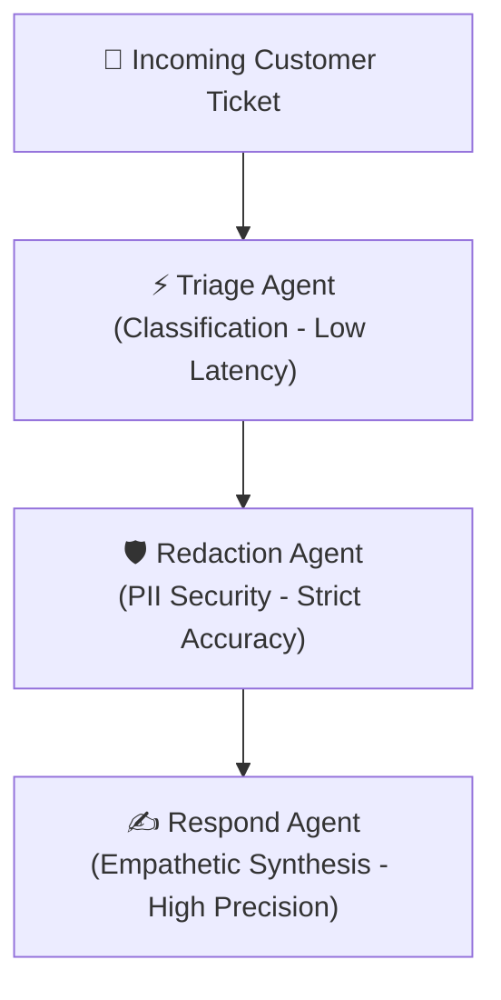

# 🧠 Heterogeneous Serving, Multi-LoRA Hot-Swapping & GPU Time-Slicing Architecture

This document provides a comprehensive architectural breakdown of the **Heterogeneous Dual-Engine Inference Platform**, explaining why it was designed, how **Multi-LoRA dynamic hot-swapping** operates, how **NVIDIA GPU Time-Slicing** enables multi-pod execution on a single physical GPU, and how the **Gateway** dynamically routes agent workloads.

---

## 🎯 1. Architectural Motivation: Why Heterogeneous Serving?

In multi-agent LLM systems, distinct tasks have drastically different latency, reasoning, and precision profiles:



- **Triage & Classification**: Requires ultra-low latency, small token counts, and fast JSON extraction.
- **PII Redaction**: Requires high pattern adherence and security compliance.
- **Response Synthesis**: Requires high-precision empathetic tone, facts extraction from Knowledge Bases, and coherent sentence structure.

### The Monolithic Serving Bottleneck
Running a single, giant model for all steps wastes GPU compute on trivial classification tasks. Conversely, deploying multiple separate full-sized models exhausts GPU VRAM, causing Kubernetes pods to lock the GPU and hang in `Pending`.

---

## 🏛️ 2. The Solution: Heterogeneous Dual-Engine + Multi-LoRA

The platform deploys two specialized engines alongside a local CPU fallback:

```mermaid
graph TD
    Client["🤖 Agent Worker Orchestrator"] -->|HTTP /v1/chat/completions| Gateway["🚪 API Gateway (Routing Service)"]
    
    subgraph Routing["Dynamic Workload Routing"]
        Gateway -->|workload_type: responder / reasoning| Prec["🧠 vLLM Precision Node<br/>(Base Llama-3.2-3B, Port 8080)"]
        Gateway -->|workload_type: triage / redactor| Thru["⚡ vLLM Throughput Node (AWQ 4-bit)<br/>(Multi-LoRA Hot-Swapping, Port 8080)"]
        Gateway -.->|workload_type: local| Ollama["🦙 Ollama (CPU Fallback, Port 11434)"]
    end

    subgraph GPU["Single Physical GPU (NVIDIA Time-Slicing: 4 Virtual Replicas)"]
        Prec -->|VRAM Slice 1 (45% VRAM)| VRAM[("Shared GPU Memory Buffer")]
        Thru -->|VRAM Slice 2 (45% VRAM)| VRAM
    end

    subgraph Adapters["Dynamic LoRA Modules (Hot-Swapped in Milliseconds)"]
        Thru -->|model: reasoning-lora| L1["🏷️ Triage Adapter"]
        Thru -->|model: reflection-lora| L2["🛡️ PII Redaction Adapter"]
        Thru -->|model: base| L3["⚡ Fast Base Actions"]
    end
```

---

## ⚙️ 3. Engine Breakdown & Workload Matrix

The platform supports two complementary model profiles: the **Primary Production Baseline** (Qwen family, configured in Kubernetes manifests and root Docker Compose for lightweight sub-12GB GPU execution) and the **Alternative Multi-Profile Stack** (`infra/compose/docker-compose.yml --profile gpu` for Llama-3.2):

### Primary Production Baseline (Qwen Stack)
| Engine | Deployment Name | Model / Quantization | Memory Utilization | Specialized Workloads |
| :--- | :--- | :--- | :--- | :--- |
| **vLLM Precision** | `vllm-responder` | `Qwen/Qwen2.5-1.5B-Instruct` (Unquantized) | `0.38` (K8s) / `0.90` (`kvcached`) | `responder`, `reasoning`, `synthesis`, `precision` |
| **vLLM Throughput** | `vllm-agents` | `Qwen/Qwen2.5-0.5B-Instruct` + Multi-LoRA | `0.22` (K8s) / `0.90` (`kvcached`) | `triage`, `redactor`, `throughput`, `fast_action` |
| **Ollama Fallback** | `ollama` | `qwen2.5:1.5b-instruct-q4_K_M` (or `llama3:8b`) | CPU / RAM | `local`, `cpu`, offline batch |

### Alternative Multi-Profile Stack (Llama-3.2 Profile in `infra/compose/`)
| Engine | Deployment Name | Model / Quantization | Memory Utilization | Specialized Workloads |
| :--- | :--- | :--- | :--- | :--- |
| **vLLM Responder** | `vllm-responder` | `meta-llama/Llama-3.2-3B-Instruct` (FP16/BF16) | `0.45` (45% VRAM) | `responder`, `reasoning`, `synthesis` |
| **vLLM Agents** | `vllm-agents` | `meta-llama/Llama-3.2-3B-Instruct` (AWQ 4-bit) + LoRA | `0.45` (45% VRAM) | `triage`, `redactor`, `fast_action` |

---

## 🔀 4. Multi-LoRA Dynamic Hot-Swapping in vLLM

### How Multi-LoRA Works
vLLM's Multi-LoRA architecture allows a single frozen base model to host multiple fine-tuned parameter adapters in memory simultaneously. When a request arrives with a specific adapter specified in the `model` payload, vLLM applies the low-rank delta weights on the fly without reloading base model weights.

#### Primary Production Manifest (`infra/kubernetes/base/vllm-agents-deployment.yaml` & root `docker-compose.yml`):
```yaml
command:
  - vllm
  - serve
  - Qwen/Qwen2.5-0.5B-Instruct
  - --gpu-memory-utilization
  - "0.22"
  - --max-model-len
  - "1024"
  - --enforce-eager
  - --enable-lora
  - --max-loras
  - "4"
  - --lora-modules
  - reasoning-lora=wuyanzu4692/task-13-Qwen-Qwen2.5-0.5B-Instruct
  - reflection-lora=Hebisuke/Qwen2.5-0.5B-Instruct_bias2_0.5B
  - --port
  - "8080"
```

#### Alternative Compose Stack (`infra/compose/docker-compose.yml`):
```yaml
command:
  - --model
  - meta-llama/Llama-3.2-3B-Instruct
  - --quantization
  - awq
  - --enable-lora
  - --max-loras
  - "4"
  - --lora-modules
  - reasoning-lora=alokabhishek/llama-3.2-3B-Instruct-lora-text2sql
  - reflection-lora=justmalhar/llama-3.2-3B-Instruct-Reflection-Beta-LoRA
  - --port
  - "8080"
```

### Request Flow:
1. **Triage Agent** sends `model="reasoning-lora"`, `workload_type="triage"` → Gateway routes to `vllm-agents` → vLLM activates the triage adapter.
2. **Redact Agent** sends `model="reflection-lora"`, `workload_type="redactor"` → Gateway routes to `vllm-agents` → vLLM activates the redaction adapter.
3. **Respond Agent** sends `workload_type="responder"` → Gateway routes to `vllm-responder` → vLLM generates the final customer response with full float precision.

---

## 🔪 5. NVIDIA GPU Time-Slicing in Kubernetes

### The Single-GPU Problem
Standard Kubernetes GPU schedulers enforce exclusive allocation: 1 Pod = 1 GPU. If two vLLM pods request `nvidia.com/gpu: 1`, the second pod hangs in `Pending`.

### The Solution: Fractional Time-Slicing
Using the NVIDIA Device Plugin Time-Slicing ConfigMap ([`infra/kubernetes/kind/gpu-time-slicing.yaml`](../../infra/kubernetes/kind/gpu-time-slicing.yaml)), Kubernetes divides 1 physical GPU into 4 virtual GPU time-slices:

```yaml
apiVersion: v1
kind: ConfigMap
metadata:
  name: time-slicing-config
  namespace: kube-system
data:
  any: |-
    version: v1
    flags:
      migStrategy: "none"
    sharing:
      timeSlicing:
        resources:
          - name: nvidia.com/gpu
            replicas: 4
```

### Applying Time-Slicing to Your Cluster:
```bash
# 1. Apply the ConfigMap
kubectl apply -f infra/kubernetes/kind/gpu-time-slicing.yaml

# 2. Patch the NVIDIA Device Plugin DaemonSet
kubectl patch daemonset nvidia-device-plugin-daemonset -n kube-system \
  --type='json' \
  -p='[{"op": "add", "path": "/spec/template/spec/containers/0/args", "value": ["--config-file=/etc/kubernetes/nvidia-config/any"]}]'
```

> [!IMPORTANT]
> **VRAM Budgeting Rule:**  
> Because both `vllm-responder` and `vllm-agents` share the same physical VRAM, both deployments MUST set `--gpu-memory-utilization 0.45` to prevent CUDA Out-Of-Memory (OOM) errors.

---

## 💻 6. Gateway Dynamic Routing Service

In [`apps/gateway/app/application/routing_service.py`](../../apps/gateway/app/application/routing_service.py):

```python
class RoutingService:
    def __init__(self, use_mock: bool = False):
        self.vllm_responder = (
            MockClient() if use_mock else VllmClient(base_url=settings.vllm_responder_base_url)
        )
        self.vllm_agents = (
            MockClient() if use_mock else VllmClient(base_url=settings.vllm_agents_base_url)
        )
        self.ollama = MockClient() if use_mock else OllamaClient()

    def get_backend(self, workload_type: str) -> BackendClient:
        if workload_type in ("responder", "reasoning", "precision", "synthesis"):
            return self.vllm_responder
        elif workload_type in ("triage", "redactor", "throughput", "fast_action", "classification"):
            return self.vllm_agents
        elif workload_type in ("local", "cpu"):
            return self.ollama
        else:
            return self.vllm_agents
```

---

## 🚀 7. Deployment & Verification

### Deploying to Kubernetes
```bash
# Deploy all Gateway, Worker, UI, and Dual vLLM Services
kubectl apply -k infra/kubernetes/base

# Check pod status
kubectl get pods -o wide
```

### Running with Docker Compose (Local GPU)
```bash
docker compose -f infra/compose/docker-compose.yml --profile gpu up -d --build
```

### Running Automated Test Suite
```powershell
.\.venv\Scripts\pytest -v
```
