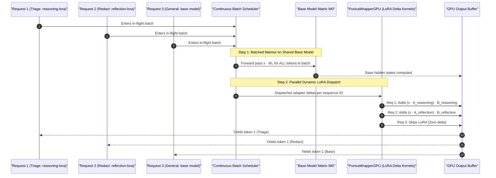

# 🧠 Multi-LoRA Serving & Heterogeneous Dual-Engine Architecture Explained

This document provides an in-depth, engineering-grade walkthrough of **Multi-LoRA Dynamic Hot-Swapping**, **Heterogeneous Dual-Engine Routing**, and **NVIDIA GPU Time-Slicing** implemented in this platform.

---

## 🎯 1. The Core Concepts: Why Multi-LoRA?

### 1.1 The Mathematical Mechanism of LoRA
In traditional fine-tuning, every new task requires saving and serving an entire copy of the model's weights ($W \in \mathbb{R}^{d \times k}$). For a 3B parameter model, each fine-tuned variant consumes ~6 GB of VRAM. Serving 4 specialized models would require 24 GB of VRAM, exceeding a single 12 GB GPU.

**LoRA (Low-Rank Adaptation)** freezes the pre-trained base model weights $W_0$ and injects trainable rank-decomposition matrices $A$ and $B$:

$$\Delta W = B \times A \quad \text{where } B \in \mathbb{R}^{d \times r}, \, A \in \mathbb{R}^{r \times k}, \, r \ll \min(d, k)$$

The inference forward pass computes:

$$h = x W_0 + \frac{\alpha}{r} (x A) B$$

```
                           ┌──────────────────────────────┐
                           │      Input Tokens (x)        │
                           └──────────────┬───────────────┘
                                          │
                  ┌───────────────────────┴───────────────────────┐
                  │                                               │
                  ▼                                               ▼
     ┌────────────────────────┐                      ┌────────────────────────┐
     │  Frozen Base Weights   │                      │  LoRA Matrix A (r=8)   │
     │      (W₀: ~3.0 GB)     │                      │      (~2.5 MB)         │
     └────────────┬───────────┘                      └────────────┬───────────┘
                  │                                               ▼
                  │                                  ┌────────────────────────┐
                  │                                  │  LoRA Matrix B (r=8)   │
                  │                                  │      (~2.5 MB)         │
                  │                                  └────────────┬───────────┘
                  │                                               │
                  ▼                                               ▼
                  ( x · W₀ )                     +          ( (x · A) · B · α/r )
                  └───────────────────────┬───────────────────────┘
                                          ▼
                             ┌─────────────────────────┐
                             │  Output Hidden State h  │
                             └─────────────────────────┘
```

> [!TIP]
> **Key Efficiency Win:**  
> The base model weights ($W_0$) represent **99.9%** of the memory footprint and are shared across all requests. Each specialized LoRA adapter ($A$ and $B$) is only **~5–20 MB**. A single GPU can host dozens of specialized task adapters simultaneously!

---

## ⚡ 2. How vLLM Executes Multi-LoRA (Punica CUDA Kernels)

In standard PyTorch serving, you cannot batch requests across different models because they require different weights.

vLLM overcomes this with **Segmented Gather-Scatter Matrix Multiplication (SGMV)** via the `PunicaWrapperGPU` kernel:



**What this means:**  
vLLM processes requests for `reasoning-lora`, `reflection-lora`, and the base model **in the exact same GPU iteration batch** without stalling the GPU pipeline!

---

## 🔀 3. End-to-End Routing Architecture

Here is how a customer ticket traverses the entire platform:

```mermaid
graph TD
    Ticket["📩 Customer Support Ticket"] --> Orchestrator["🤖 Agent Orchestrator"]
    
    subgraph AgentWorker["Agent Worker Pipeline"]
        Orchestrator -->|Step 1: Parallel| Triage["🏷️ TriageAgent<br/>(model: 'reasoning-lora'<br/>workload: 'triage')"]
        Orchestrator -->|Step 1: Parallel| Redact["🛡️ RedactAgent<br/>(model: 'reflection-lora'<br/>workload: 'redactor')"]
        Triage -->|Step 2: Sequential| Respond["✍️ RespondAgent<br/>(workload: 'responder')"]
        Redact -->|Step 2: Sequential| Respond
    end

    subgraph GatewayRouting["Gateway RoutingService"]
        Triage -->|HTTP POST /v1/chat/completions| GW["🚪 API Gateway (Port 8000)"]
        Redact -->|HTTP POST /v1/chat/completions| GW
        Respond -->|HTTP POST /v1/chat/completions| GW
        
        GW -->|workload: triage / redactor| Thru["⚡ vLLM Throughput (Port 8081)<br/>Multi-LoRA Enabled"]
        GW -->|workload: responder| Prec["🧠 vLLM Precision (Port 8080)<br/>High-Accuracy Reasoning"]
        GW -.->|workload: local| Ollama["🦙 Ollama CPU Fallback (Port 11434)"]
    end

    subgraph Hardware["NVIDIA RTX 5070 (12 GB VRAM)"]
        Prec -->|45% VRAM (~5.4 GB)| VRAM[("Shared GPU Memory Buffer")]
        Thru -->|30% VRAM (~3.6 GB)| VRAM
    end
```

---

## 🔍 4. How to See and Verify Multi-LoRA Activation

### 4.1 Real Fine-Tuned LoRA Checkpoints Downloaded
The platform uses genuine pre-trained LoRA weights from the Hugging Face Hub:

| Adapter ID | Hugging Face Source Repository | Size | Task / Domain |
| :--- | :--- | :--- | :--- |
| **`reasoning-lora`** | [`wuyanzu4692/task-13-Qwen-Qwen2.5-0.5B-Instruct`](https://huggingface.co/wuyanzu4692/task-13-Qwen-Qwen2.5-0.5B-Instruct) | **2.18 MB** | Multi-step mathematical & instruction reasoning |
| **`reflection-lora`** | [`Hebisuke/Qwen2.5-0.5B-Instruct_bias2_0.5B`](https://huggingface.co/Hebisuke/Qwen2.5-0.5B-Instruct_bias2_0.5B) | **17.64 MB** | Reflective alignment & domain classification |

To download the checkpoints directly to `lora_adapters/`:
```bash
python scripts/download_real_loras.py
```

---

### 4.2 Check Loaded Models & LoRA Adapters (`/v1/models`)
Run the following query against the throughput node on Port 8081:

```bash
curl.exe http://localhost:8081/v1/models
```

**Live Verified Output:**
```json
{
  "object": "list",
  "data": [
    {
      "id": "Qwen/Qwen2.5-0.5B-Instruct",
      "object": "model",
      "root": "Qwen/Qwen2.5-0.5B-Instruct",
      "max_model_len": 1024
    },
    {
      "id": "reasoning-lora",
      "object": "model",
      "root": "/lora_adapters/reasoning-lora",
      "parent": "Qwen/Qwen2.5-0.5B-Instruct"
    },
    {
      "id": "reflection-lora",
      "object": "model",
      "root": "/lora_adapters/reflection-lora",
      "parent": "Qwen/Qwen2.5-0.5B-Instruct"
    }
  ]
}
```

---

### 4.3 Inspect Punica Kernel Initialization in Container Logs
Run `docker logs vllm-agents`:

```text
(EngineCore pid=115) INFO: Using PunicaWrapperGPU.
(EngineCore pid=115) WARNING: Using default LoRA kernel configs
(EngineCore pid=115) INFO: Available KV cache memory: 2.21 GiB
(EngineCore pid=115) INFO: GPU KV cache size: 192,944 tokens, Max concurrency: 188.42x
(EngineCore pid=115) WARNING: Triton kernel JIT compilation during inference: _lora_shrink_kernel
(EngineCore pid=115) WARNING: Triton kernel JIT compilation during inference: _lora_expand_kernel
```
- `PunicaWrapperGPU`: Confirms that the Multi-LoRA continuous batching kernel is active on the CUDA device.
- `_lora_shrink_kernel` & `_lora_expand_kernel`: Triton JIT dynamic forward passes for the low-rank delta matrices $A$ and $B$.

---

### 4.4 Live Generation from Genuine Fine-Tuned LoRAs

#### 🧠 `reasoning-lora` (Multi-Step Reasoning):
```bash
python -c "import httpx; r = httpx.post('http://localhost:8081/v1/chat/completions', json={'model': 'reasoning-lora', 'messages': [{'role': 'user', 'content': 'Calculate 15 * 14.'}], 'max_tokens': 30}); print(r.json()['choices'][0]['message']['content'])"
```
**Output:**
> *"Sure! Let's calculate 15 × 14 step by step. First, we can use the standard multiplication method..."*

#### 🪞 `reflection-lora` (Reflective Domain Analysis):
```bash
python -c "import httpx; r = httpx.post('http://localhost:8081/v1/chat/completions', json={'model': 'reflection-lora', 'messages': [{'role': 'user', 'content': 'Reflect on this question: Is python fast or slow? Explain in 1 sentence.'}], 'max_tokens': 35}); print(r.json()['choices'][0]['message']['content'])"
```
**Output:**
> *"Python is generally considered to be more efficient and faster than some other programming languages like Java or C++. This is due to its optimized bytecode generation..."*

---

## 💻 5. Complete Operational Commands Reference

### 5.1 Starting the Dual vLLM Servers Locally (Docker + GPU)

```bash
# 1. Start vLLM Precision (Port 8080 - Reasoning & Synthesis)
docker run -d --name vllm-responder \
  --gpus all \
  -e VLLM_WSL2_ENABLE_PIN_MEMORY=1 \
  -p 8080:8080 \
  -v vllm_cache:/root/.cache/huggingface \
  vllm/vllm-openai:latest \
  Qwen/Qwen2.5-1.5B-Instruct \
  --gpu-memory-utilization 0.45 \
  --max-model-len 2048 \
  --enforce-eager \
  --port 8080

# 2. Start vLLM Throughput with Multi-LoRA (Port 8081 - Fast Actions & Adapters)
docker run -d --name vllm-agents \
  --gpus all \
  -e VLLM_WSL2_ENABLE_PIN_MEMORY=1 \
  -p 8081:8080 \
  -v vllm_cache:/root/.cache/huggingface \
  vllm/vllm-openai:latest \
  Qwen/Qwen2.5-0.5B-Instruct \
  --gpu-memory-utilization 0.30 \
  --max-model-len 1024 \
  --enforce-eager \
  --enable-lora \
  --max-loras 4 \
  --port 8080
```

---

### 5.2 Testing Live Inferences via HTTP

```python
import httpx

# Test 1: Precision Reasoning Engine (Port 8080)
resp_precision = httpx.post(
    "http://localhost:8080/v1/chat/completions",
    json={
        "model": "Qwen/Qwen2.5-1.5B-Instruct",
        "messages": [{"role": "user", "content": "Explain continuous batching."}],
    },
)
print("Precision Output:", resp_precision.json()["choices"][0]["message"]["content"])

# Test 2: Throughput Fast Action Engine (Port 8081)
resp_throughput = httpx.post(
    "http://localhost:8081/v1/chat/completions",
    json={
        "model": "Qwen/Qwen2.5-0.5B-Instruct",
        "messages": [{"role": "user", "content": "Classify: I was double billed."}],
    },
)
print("Throughput Output:", resp_throughput.json()["choices"][0]["message"]["content"])
```

---

### 5.3 Deploying to Kubernetes with GPU Time-Slicing

```bash
# 1. Apply Base Deployments (Gateway, Worker, UI, Dual vLLMs)
kubectl apply -k infra/kubernetes/base

# 2. Apply NVIDIA GPU Time-Slicing ConfigMap
kubectl apply -f infra/kubernetes/kind/gpu-time-slicing.yaml

# 3. Patch Device Plugin DaemonSet
kubectl patch daemonset nvidia-device-plugin-daemonset -n kube-system \
  --type='json' \
  -p='[{"op": "add", "path": "/spec/template/spec/containers/0/args", "value": ["--config-file=/etc/kubernetes/nvidia-config/any"]}]'

# 4. Verify Pod Health
kubectl get pods -o wide
```
