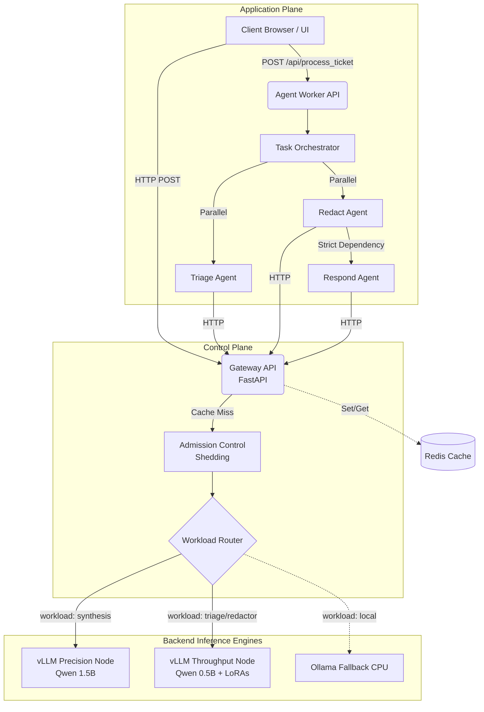

# Platform Architecture Overview

## The Big Picture

The `agentic-llm-serving-platform` is designed as a high-throughput, cost-efficient inference layer. It acts as the bridge between client applications and the underlying Large Language Models (LLMs).

### Core Components

1. **Gateway (`apps/gateway`)**
   - **Role:** The primary ingress point of the platform.
   - **Responsibilities:** Receives incoming HTTP requests, performs admission control (to prevent system overload), enforces token and request timeouts, and routes requests to the appropriate backend model.
   - **Caching:** Utilizes exact-match caching (respecting tenant and authorization boundaries) to serve repeated queries instantly, minimizing expensive LLM invocations.

2. **Agent Worker (`apps/agent-worker`)**
   - **Role:** The orchestrator for complex, multi-step LLM workflows.
   - **Responsibilities:** Manages "Task Graphs" for AI agents performing multi-step operations (e.g., retrieval, reasoning, summarization). It handles task fan-out for parallel execution and safely propagates cancellations if a parent task fails.

3. **Playground (`apps/playground`)**
   - **Role:** The browser-based frontend UI for the platform.
   - **Responsibilities:** A React/Vite application (served by Nginx in production). Provides an interactive interface to submit customer tickets and observe the multi-agent pipeline in action. Communicates with the Agent Worker API.

4. **Inference Engines (Backends)**
   - **vLLM (Precision Node):** Dedicated high-accuracy reasoning node serving `Qwen/Qwen2.5-1.5B-Instruct`. Handles final response synthesis and complex multi-step reasoning.
   - **vLLM (Throughput Node):** High-speed node serving `Qwen/Qwen2.5-0.5B-Instruct` with Multi-LoRA dynamic hot-swapping enabled. Rapidly switches between `reasoning-lora` and `reflection-lora` for micro-agents.
   - **Ollama (Legacy/Local):** A local CPU fallback for environments without GPU resources, serving heavily quantized GGUF models.

5. **Shared Packages (`packages/`)**
   - Contains reusable logic shared across the Gateway and Agent Worker:
     - `contracts`: Unified Data Transfer Objects (Pydantic models) used for inter-service communication.
     - `prompt-engine`: Logic for assembling prompts deterministically, which is critical for maximizing prefix-cache hit rates in vLLM.
     - `retrieval`: Logic for safely managing context limits and budgeting document chunks during Retrieval-Augmented Generation (RAG).

## Architecture Diagram

## Request Flow

1. A client application submits a request.
2. The request is intercepted by the **Gateway**.
3. The Gateway evaluates the **Cache**. On a cache hit, the response is returned immediately.
4. On a cache miss, the Gateway engages **Admission Control**. If the system is saturated, the request is rejected early (HTTP 503) to maintain system stability.
5. Once admitted, the **Routing Service** evaluates the `workload_type` (e.g., `chat` vs `batch`) and forwards the request to the appropriate backend (**vLLM** or **Ollama**).
6. The selected engine processes the prompt and streams the response back through the Gateway to the client.
