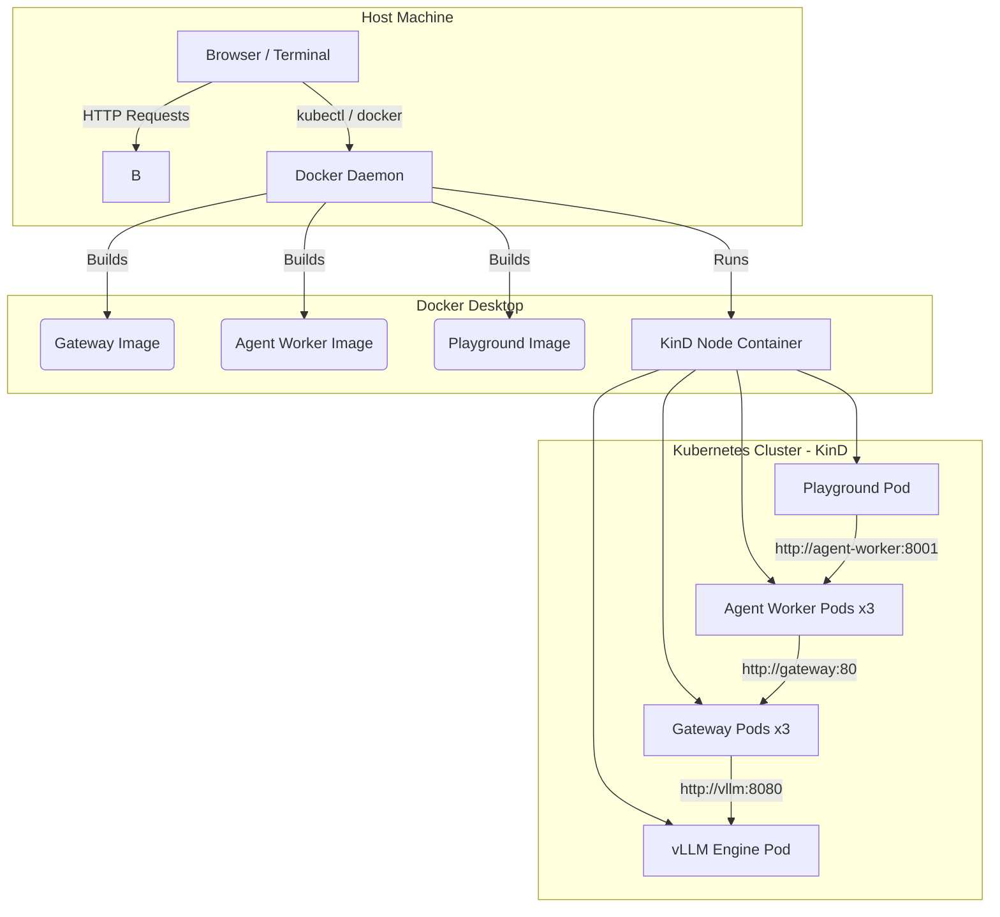

# System Architecture & Flow Guide

This document breaks down how your local environment, Docker daemon, and Kubernetes cluster interact to power the Cost-Efficient LLM Serving Platform. 

---

## 1. The Core Infrastructure

At a high level, your machine is running three interconnected layers:

1. **Host Machine (Windows)**: Where you edit code, run local Python scripts (like the micro-agents), and use the Playground UI.
2. **Docker Desktop**: The virtualization engine that builds containers and runs the Kubernetes control plane.
3. **KinD (Kubernetes in Docker)**: A local Kubernetes cluster that runs inside a Docker container. It manages all application pods: Gateway, Agent Worker, Playground, and vLLM Engine.



---

## 2. How Services Communicate in Kubernetes

> **Key Concept: Kubernetes DNS**
> When you create a Kubernetes Service (e.g., `gateway-service.yaml` with `name: gateway`), Kubernetes automatically creates a DNS entry inside the cluster. Any pod can reach the gateway by simply calling `http://gateway:80`. No hardcoded IP addresses are needed.

This is why we **don't use `localhost`** in Kubernetes. Each pod is its own isolated network namespace — `localhost` inside the gateway pod only refers to the gateway container itself. To reach the vLLM engine, the gateway must use the **Service DNS name**: `http://vllm:8080`.

### Service Communication Map

| From | To | URL Used | Defined In |
| :--- | :--- | :--- | :--- |
| **Agent Worker** | Gateway | `http://gateway:80` | `agent-worker-deployment.yaml` (env: `GATEWAY_URL`) |
| **Gateway** | vLLM Engine | `http://vllm:8080/v1` | `common/config.py` (env: `VLLM_BASE_URL`) |
| **Gateway** | Ollama | `http://ollama:11434` | `common/config.py` (env: `OLLAMA_BASE_URL`) |
| **Playground UI** | Agent Worker | `http://agent-worker:8001` | Nginx config / frontend API calls |
| **Browser (local dev)** | Playground | `http://localhost:3000` or K8s port-forward | `docker-compose.yml` / `playground-service.yaml` |

---

## 3. Component Flow: What is Running What?

### The Gateway (`apps/gateway`)
- **What it is**: A high-performance Python FastAPI server.
- **Where it runs**: Inside Kubernetes as a Deployment (`gateway-deployment.yaml`). It scales between 3 to 20 pods via HPA.
- **Its Job**: Acts as the "front door". It checks admission limits, calculates cache hits (using tenant-scoped SHA-256 keys), and forwards requests to the appropriate backend (vLLM or Ollama).
- **Docker image**: Built from `apps/gateway/Dockerfile`.

### The Agent Worker (`apps/agent-worker`)
- **What it is**: A FastAPI service that orchestrates multi-agent workflows (TriageAgent, RedactAgent, RespondAgent).
- **Where it runs**: Inside Kubernetes as a Deployment (`agent-worker-deployment.yaml`). 3 replicas by default.
- **Its Job**: Receives raw customer tickets and breaks them into parallel micro-agent tasks, sending each prompt to the Gateway via its K8s DNS name (`http://gateway:80`).
- **Docker image**: Built from `apps/agent-worker/Dockerfile`.

### The Playground (`apps/playground`)
- **What it is**: A React/Vite frontend UI served by Nginx.
- **Where it runs**: Inside Kubernetes as a Deployment (`playground-deployment.yaml`). 1 replica.
- **Its Job**: Provides a browser interface for users to submit tickets and see the multi-agent pipeline in action.
- **Docker image**: Built from `apps/playground/Dockerfile` (multi-stage: Node.js build → Nginx serve).

### The vLLM Engine (`infra/kubernetes/base/vllm-deployment.yaml`)
- **What it is**: The highly optimized C++/CUDA inference engine.
- **Where it runs**: Inside Kubernetes as a single Pod (`vllm`).
- **Its Job**: Holds the `Llama-3.2-3B` base model in GPU memory, along with multiple LoRA adapters. When the Gateway forwards a request for `model="reasoning-lora"`, vLLM dynamically layers that adapter over the base model in milliseconds.

---

## 4. The Lifecycle of a Request (Step-by-Step)

1. You type a ticket into the **Playground UI** (running in K8s or locally at `http://localhost:3000`).
2. The UI sends the ticket to the **Agent Worker** (`http://agent-worker:8001/api/process_ticket` in K8s).
3. The **Orchestrator** splits the ticket and simultaneously dispatches to the `TriageAgent` and `RedactAgent`.
4. Each Agent sends its system prompt + user message to the **Gateway** (`http://gateway:80/v1/chat/completions`).
5. The Gateway applies **Admission Control** (rejects if overloaded with HTTP 503), checks the **exact-match cache**, and on a miss, routes to the **vLLM Engine** (`http://vllm:8080`).
6. vLLM uses **Prefix Caching** to skip re-reading shared prompt prefixes, hot-swaps to the correct LoRA adapter, and generates the response.
7. Once Triage and Redact finish in parallel, the Orchestrator triggers the `RespondAgent` to write the final reply.

---

## 5. The Import Architecture (How Python Packages Work)

This monorepo uses a **uv workspace** (defined in the root `pyproject.toml`). The workspace members are:
- `apps/gateway`
- `apps/agent-worker`
- `packages/common`, `packages/contracts`, `packages/prompt-engine`, `packages/retrieval`, `packages/evaluation`

The shared packages live under `packages/<name>/src/<name>/`. The root `pyproject.toml` configures `pythonpath` entries for pytest, and `uv run` automatically resolves workspace dependencies. This is why you can write:

```python
from contracts.openai_models import ChatCompletionRequest
from common.config import settings
```

These are **not** pip packages from PyPI. They are local workspace packages resolved by `uv`. The `contracts` module physically lives at `packages/contracts/src/contracts/openai_models.py`.

> **Why linters may complain:** Static analysis tools (like Pyrefly, Pylance) don't always understand `uv` workspace resolution. You may see "missing import" warnings — these are **false positives**. The code runs correctly because `uv run` handles the path resolution. You can suppress these with linter-specific comments, but they are not required for correctness.

---

## 6. Operational Commands Cheatsheet

### Build Docker Images
```bash
# Build all three application images from the repo root
docker build -t gateway:latest -f apps/gateway/Dockerfile .
docker build -t agent-worker:latest -f apps/agent-worker/Dockerfile .
docker build -t playground:latest -f apps/playground/Dockerfile apps/playground
```

### Apply Kubernetes Manifests
```bash
kubectl apply -k infra/kubernetes/base
```

### Restart Pods (after image rebuild)
```bash
kubectl rollout restart deployment gateway
kubectl rollout restart deployment agent-worker
kubectl rollout restart deployment playground
```

### Check Pod Status
```bash
kubectl get pods
```

### Port-Forward for Local Access
```bash
# Access gateway from your browser
kubectl port-forward svc/gateway 8000:80

# Access playground UI from your browser
kubectl port-forward svc/playground 3000:80

# Access agent-worker API
kubectl port-forward svc/agent-worker 8001:8001
```

---
## References
- For local testing options and architectural diagrams, see: [Testing & Running Guide](../operations/testing_and_running_guide.md).
- For Kubernetes deployment details, see: [Kubernetes Deployment Guide](../operations/kubernetes_guide.md).
- For security and tenant isolation, see: [Threat Model](../security/threat_model.md).
- To view the exact Kubernetes configurations, see: [Base Infrastructure](../../infra/kubernetes/base/).
