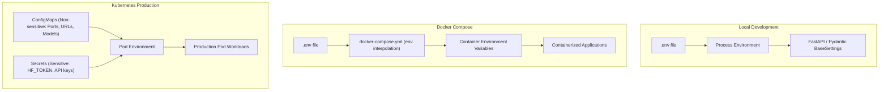

# Configuration and Environment Guide

This document describes how configuration is structured, injected, and managed across the **Cost-Efficient LLM Serving Platform** in local development, Docker Compose, and Kubernetes environments.

---

## 1. Configuration Architecture & Flow

Configuration follows a layered hierarchy:



---

## 2. Environment Variables Matrix

All configuration variables are defined with sensible defaults in [.env.example](../.env.example).

| Variable Name | Default / Example | Components Consuming | Purpose & Operational Impact |
|---|---|---|---|
| `GATEWAY_PORT` | `8000` | Gateway, Compose, K8s | HTTP listening port for FastAPI / Uvicorn server. |
| `GATEWAY_LOG_LEVEL` | `INFO` | Gateway | Logging verbosity (`DEBUG`, `INFO`, `WARNING`, `ERROR`). |
| `GATEWAY_TIMEOUT_SECONDS` | `120.0` | Gateway | Client connection and backend timeout threshold. |
| `GLOBAL_AGENT_CONCURRENCY` | `50` | Gateway | Global semaphore admission limit to prevent queue exhaustion. |
| `PER_BACKEND_CONCURRENCY` | `20` | Gateway | Per-model-engine concurrency throttle. |
| `PER_WORKFLOW_CONCURRENCY` | `10` | Gateway | Maximum simultaneous child tasks per multi-agent workflow. |
| `USE_MOCK` | `False` | Gateway, Agent Worker | When `True`, returns instant simulated LLM outputs (ideal for CI/CD and offline UI dev). |
| `VLLM_RESPONDER_BASE_URL` | `http://vllm-responder:8080/v1` | Gateway, Agent Worker | Base endpoint for the high-accuracy synthesis engine (Qwen 1.5B). |
| `VLLM_RESPONDER_MODEL` | `Qwen/Qwen2.5-1.5B-Instruct` | Gateway, Deployments | Model name passed in OpenAI chat completion requests. |
| `VLLM_AGENTS_BASE_URL` | `http://vllm-agents:8080/v1` | Gateway, Agent Worker | Base endpoint for the high-throughput multi-LoRA worker (Qwen 0.5B). |
| `VLLM_AGENTS_MODEL` | `Qwen/Qwen2.5-0.5B-Instruct` | Gateway, Deployments | Base model running on the agents engine. |
| `VLLM_TRIAGE_LORA` | `reasoning-lora` | Agent Worker | Hot-swapped adapter module identifier for classification. |
| `VLLM_REDACT_LORA` | `reflection-lora` | Agent Worker | Hot-swapped adapter module identifier for PII scrubbing. |
| `OLLAMA_BASE_URL` | `http://ollama:11434` | Gateway | Endpoint for CPU-only local execution fallback. |
| `REDIS_URL` | `redis://redis:6379/0` | Gateway, Agent Worker | Exact-match key-value cache and session state backend. |
| `HF_TOKEN` | *None (Secret)* | vLLM Deployments | Hugging Face user access token required to fetch private or gated weights. |
| `ENABLE_METRICS` | `true` | Gateway, Worker | Toggles Prometheus `/metrics` exposition. |
| `VITE_API_URL` | `http://localhost:8001` | Playground UI | Browser frontend target for pipeline triggering. |

---

## 3. Network Addressing: Local vs. Container vs. Kubernetes

A common source of connection failure is using the wrong hostname across network environments:

| Destination Service | Local Machine Direct | Docker Compose Bridge | Kubernetes Cluster |
|---|---|---|---|
| **Gateway** | `http://localhost:8000` | `http://gateway:8000` | `http://gateway:8000` (or Ingress) |
| **Agent Worker** | `http://localhost:8001` | `http://agent-worker:8001` | `http://agent-worker:8001` |
| **Redis** | `redis://localhost:6379/0` | `redis://redis:6379/0` | `redis://redis:6379/0` |
| **vLLM Responder** | `http://localhost:8082/v1` | `http://vllm-responder:8080/v1` | `http://vllm-responder:8080/v1` |
| **vLLM Agents** | `http://localhost:8083/v1` | `http://vllm-agents:8080/v1` | `http://vllm-agents:8080/v1` |

---

## 4. Secrets Management

### Security Principle
> **Never commit `.env` or plain-text secrets to Git.**
> The `.gitignore` is pre-configured to ignore `.env`, while `.env.example` contains only structural placeholders.

### Passing Secrets in Docker Compose
Use environment variables on the host or a local `.env` file that is not committed:
```bash
export HF_TOKEN="hf_your_actual_token"
docker compose up -d
```

### Passing Secrets in Kubernetes
In Kubernetes, sensitive credentials should be stored in a Kubernetes Secret:
```bash
kubectl create secret generic llm-secrets \
  --from-literal=HF_TOKEN="hf_your_actual_token" \
  --namespace=default
```

Reference the secret in deployments:
```yaml
env:
  - name: HF_TOKEN
    valueFrom:
      secretKeyRef:
        name: llm-secrets
        key: HF_TOKEN
```

---

## 5. Quick Verification

To verify that environment variables are correctly loaded and active:

```bash
# Verify Gateway health and active settings
curl http://localhost:8000/healthz

# Verify Docker Compose environment variable resolution
docker compose config

# Inspect environment variables inside running container
docker compose exec gateway printenv | grep -E "(VLLM|GATEWAY|REDIS)"
```

---

## 🧭 Related Documentation

- [Docker Guide](docker-guide.md) - Local container orchestration.
- [Kubernetes Guide](kubernetes-guide.md) - Production cluster manifests and scaling.
- [Troubleshooting Guide](troubleshooting.md) - Common misconfiguration diagnostics.
- [Architecture Overview](architecture/overview.md) - System architecture and component routing.
