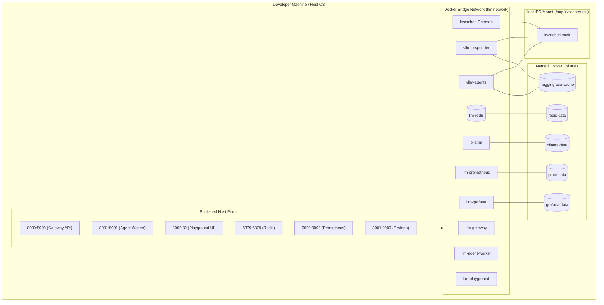

# Docker & Docker Compose Guide

This guide provides a comprehensive technical walkthrough of how containerization is implemented in the **Cost-Efficient LLM Serving Platform**. It serves both as operational documentation for the repository and as an educational reference for developers learning containerization patterns in production AI/ML systems.

---

## 1. Container Architecture Overview

The platform uses Docker to package multiple decoupled services:



---

## 2. Dockerfile Deep Dive: `apps/gateway/Dockerfile`

The API Gateway is built using a multi-stage, security-hardened Dockerfile:

```dockerfile
FROM python:3.11-slim as builder
WORKDIR /app
COPY pyproject.toml .
RUN pip install --no-cache-dir .

FROM python:3.11-slim
WORKDIR /app
COPY --from=builder /usr/local/lib/python3.11/site-packages /usr/local/lib/python3.11/site-packages
COPY apps/gateway/ apps/gateway/
COPY packages/ packages/
EXPOSE 8000
CMD ["uvicorn", "apps.gateway.app:app", "--host", "0.0.0.0", "--port", "8000"]
```

### Line-by-Line Breakdown:
1. `FROM python:3.11-slim as builder`: Uses a lightweight Debian base image for building wheels and compiling dependencies. The `as builder` syntax initiates a **multi-stage build**.
2. `WORKDIR /app`: Sets the current working directory inside the build container.
3. `RUN pip install --no-cache-dir .`: Installs platform packages. `--no-cache-dir` ensures pip doesn't save download archives, reducing temporary layer size.
4. `FROM python:3.11-slim`: Starts the lean runtime stage. Build-time tools (like gcc or git) are discarded.
5. `COPY --from=builder ...`: Copies only the installed Python site-packages from the builder stage, keeping the final container image minimal (~150MB instead of ~800MB).
6. `EXPOSE 8000`: Documents that Uvicorn listens on port 8000. *(Note: `EXPOSE` is purely documentation and metadata; it does not actually publish the port to the host).*
7. `CMD ["uvicorn", ...]`: Runs Uvicorn binding to `0.0.0.0`. Binding to `0.0.0.0` (not `127.0.0.1`) is essential so the container accepts connections originating outside its own virtual network namespace.

---

## 3. Docker Compose Profiles & Configurations

The repository provides two Docker Compose setups:

### A. Root `docker-compose.yml` (Standalone GPU Stack)
Focused specifically on Qwen model serving with GPU memory pooling:
- `vllm-responder`: Qwen 1.5B reasoning engine
- `vllm-agents`: Qwen 0.5B multi-LoRA worker
- `kvcached`: Unix domain IPC memory allocator

### B. `infra/compose/docker-compose.yml` (Multi-Profile Stack)
Provides flexible operational profiles:
- `--profile local`: For lightweight CPU machines using Ollama fallback, Mock gateways, Redis, and UI.
- `--profile gpu`: For NVIDIA GPU workstations with heterogeneous vLLM engines and hardware acceleration.

```bash
# Start local CPU dev stack:
docker compose -f infra/compose/docker-compose.yml --profile local up -d --build

# Start GPU production-mirroring stack:
docker compose -f infra/compose/docker-compose.yml --profile gpu up -d --build
```

---

## 4. Port Mappings: `HOST_PORT:CONTAINER_PORT`

Port binding syntax in Compose always follows `HOST:CONTAINER`:
- `8000:8000`: Requests sent to `http://localhost:8000` on the host machine are forwarded into port `8000` of the `gateway` container.
- `3001:3000`: Requests sent to `http://localhost:3001` on the host reach Grafana on its default container port `3000`. This prevents conflicts if the host already runs another web service on 3000.

| Service | Internal Container Port | Published Host Port | Protocol | Purpose |
|---|---|---|---|---|
| `gateway` | 8000 | 8000 | HTTP | FastAPI REST endpoints & Swagger docs |
| `agent-worker` | 8001 | 8001 | HTTP | Ticket pipeline orchestration |
| `playground` | 3000 | 3000 | HTTP | Vite/React UI |
| `redis` | 6379 | 6379 | TCP | In-memory key-value cache |
| `vllm-responder` | 8080 | 8082 / 8080 | HTTP | OpenAI-compatible inference |
| `vllm-agents` | 8080 | 8083 / 8081 | HTTP | OpenAI-compatible multi-LoRA inference |
| `prometheus` | 9090 | 9090 | HTTP | Time-series metrics scraper |
| `grafana` | 3000 | 3001 | HTTP | Metrics dashboards |

---

## 5. Storage & Persistence

Containers are ephemeral: when a container is deleted with `docker compose down`, any data written to its root filesystem is lost. The platform achieves persistence via:

1. **Named Docker Volumes**:
   - `redis-data`: Backs `/data` in Redis. Allows cache snapshots (RDB/AOF) to survive container restarts.
   - `huggingface-cache`: Backs `/root/.cache/huggingface`. Stores multi-gigabyte model weights so models are not re-downloaded every time containers restart.
   - `ollama-data`: Backs `/root/.ollama` for downloaded GGUF/quantized models.

2. **Host Bind Mounts**:
   - `/tmp/kvcached-ipc:/tmp/kvcached-ipc`: Mounts a shared host directory into `kvcached`, `vllm-responder`, and `vllm-agents`. This enables ultra-low-latency Unix Domain Socket (`.sock`) communication for VRAM arbitration.

> ⚠️ **Data Cleanup**:
> - `docker compose down`: Stops and removes containers and networks; **preserves** volumes.
> - `docker compose down -v`: Stops containers and **permanently deletes** named volumes. Use caution if you have cached large model weights.

---

## 6. Service Discovery & Networking

All services connect to an internal bridge network named `llm-network`. Docker provides automatic embedded DNS:
- Inside any container, querying `http://redis:6379` resolves to the virtual IP of the Redis container.
- The gateway reaches inference engines using internal DNS: `http://vllm-responder:8080/v1` and `http://vllm-agents:8080/v1`.
- Container-to-container communication never routes through host loopback (`127.0.0.1`), ensuring strict isolation.

---

## 7. Common Docker Operations & Commands

```bash
# Build and start all services in the background
docker compose up -d --build

# Inspect status and health of all containers
docker compose ps

# Follow real-time logs for the API Gateway
docker compose logs -f gateway

# Execute an interactive shell inside the running Gateway container
docker compose exec gateway sh

# Validate docker-compose syntax and print resolved configuration
docker compose config

# Stop all services safely
docker compose down

# Check image sizes and dangling layers
docker images
```

---

## 🧭 Related Documentation

- [Kubernetes Guide](kubernetes-guide.md) - Deploy the platform to Kubernetes clusters.
- [Configuration Guide](configuration.md) - Environment variables and secrets reference.
- [Troubleshooting Guide](troubleshooting.md) - Solutions for container crashes and healthcheck failures.
- [Architecture Overview](architecture/overview.md) - Deep dive into system components.
