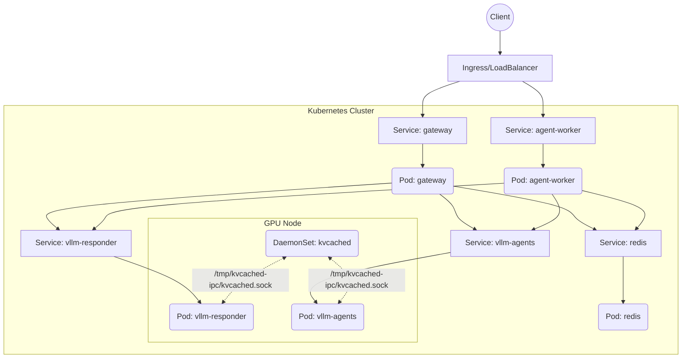

# Kubernetes Deployment Guide

This document explains how the Cost-Efficient LLM Serving platform runs on Kubernetes. It covers the core Kubernetes resources, what they do, and how they interact to provide a scalable, highly available application.

## Overview of the Cluster Architecture

The application is deployed to a Kubernetes cluster using standard manifests.



## Resources in This Project

| Kubernetes Resource | Purpose in This Project | Key Configuration | What Breaks if Misconfigured |
|---|---|---|---|
| **DaemonSet** (`kvcached`) | Runs exactly one `kvcached` VRAM manager per GPU node. | `hostPath` volume for IPC socket; `NVIDIA_VISIBLE_DEVICES=all`. | vLLM engine pods cannot start (they depend on the `kvcached` socket for memory allocation). |
| **Deployment** (`vllm-*`) | Runs the stateless vLLM inference engines. | `nvidia.com/gpu` resource limit; `hostPath` mount for `/tmp/kvcached-ipc`. | Pods will fail to schedule if GPU resources are exhausted or if memory management is misconfigured. |
| **Deployment** (`gateway`, `agent-worker`) | Runs the API gateways and application workers. | Application environment variables (`REDIS_URL`, etc.). | The application APIs will be unavailable or worker tasks won't execute. |
| **StatefulSet** (`redis`) | Runs Redis for caching and message queuing. | PersistentVolumeClaim for `/data`. | Application data loss on restart if PVC is missing; Gateway and worker pods will crash on startup if Redis is unreachable. |
| **Service** | Provides stable internal networking for pods. | `selector` matches deployment labels; `ports` expose specific container ports. | Traffic cannot reach the intended pods, causing 500/502/504 errors in dependent services. |
| **Ingress** | Routes external HTTP/HTTPS traffic to Services. | Host routing and path matching to the `gateway` Service. | Users cannot access the application from outside the cluster. |
| **ConfigMap / Secret** | Stores non-sensitive/sensitive configuration. | Mounted as environment variables or files in Deployments. | Application fails to authenticate to external services or starts with wrong settings. |

## Inter-Process Communication (IPC) for `kvcached`

One of the most critical aspects of this deployment is how `kvcached` shares physical GPU memory with the `vllm-responder` and `vllm-agents` pods.

1. The `kvcached` **DaemonSet** starts first. It has access to all GPUs and creates a Unix domain socket at `/tmp/kvcached-ipc/kvcached.sock` on the node's filesystem using a `hostPath` volume.
2. The `vllm-responder` and `vllm-agents` **Deployments** mount the exact same `hostPath` into their containers.
3. The vLLM containers use the `KVCACHED_IPC_PATH` environment variable to connect to the socket.

If the `kvcached` pod crashes or isn't scheduled on the same node, the vLLM pods will fail to start because they require the socket to allocate VRAM for their KV cache.

## Probes and Health Checks

All deployments rely on Kubernetes Probes to manage lifecycle and routing safely.

- **Liveness Probes**: Ensure the container is fundamentally running. If it fails (e.g. deadlock), Kubernetes restarts the pod.
- **Readiness Probes**: Ensure the application is ready to receive traffic. For the vLLM engines, this means the models are fully loaded into GPU memory. Traffic will not be routed to the pod until this succeeds.
- **Startup Probes**: Used on the vLLM engines to give them extended time to download weights and load models into VRAM before liveness checks kick in.

## Common `kubectl` Commands

Use these commands to inspect the cluster state (using the `llm-serving` namespace as an example).

```bash
# View all pods and their statuses
kubectl get pods -n llm-serving

# View logs for a specific pod (e.g. gateway)
kubectl logs deployment/gateway -n llm-serving -f

# Check why a pod is failing or stuck in Pending
kubectl describe pod <pod-name> -n llm-serving

# Forward a local port to a service for testing
kubectl port-forward service/vllm-responder 8080:8080 -n llm-serving

# Restart a deployment (e.g., after updating a ConfigMap)
kubectl rollout restart deployment/gateway -n llm-serving

# Check the history of a deployment
kubectl rollout history deployment/gateway -n llm-serving
```

## Scaling the Deployment

- **Stateless Services** (`gateway`, `agent-worker`): Can be scaled horizontally without constraint using `kubectl scale deployment gateway --replicas=3`.
- **vLLM Engines** (`vllm-responder`, `vllm-agents`): Can be scaled, but each pod requires dedicated GPU resources (or time-sliced GPU resources). Scaling these requires node availability.
- **kvcached**: Cannot be scaled manually. It is a DaemonSet and automatically runs exactly one instance per GPU node.
- **Redis**: Stateful. Scaling Redis requires migrating from a single instance to a Redis Cluster configuration.

## Next Steps

- Consult the [Troubleshooting Guide](troubleshooting.md) if you encounter issues.
- Read the [Architecture Document](architecture.md) for a higher-level system overview.
