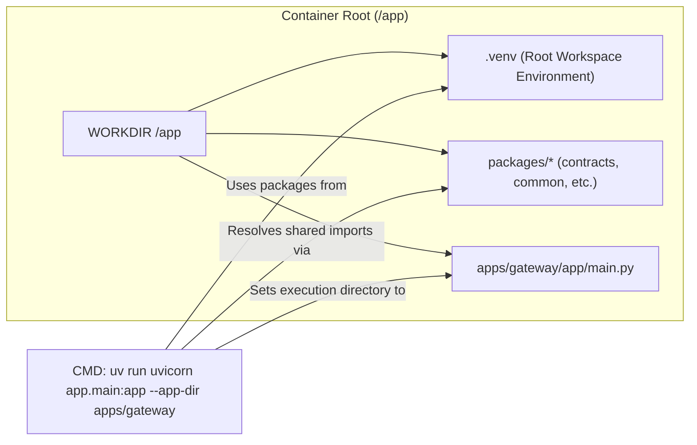
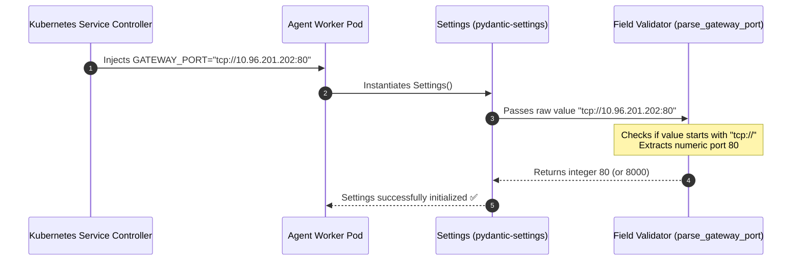

# 🛠️ Docker & Kubernetes Troubleshooting Guide: Architecture, Core Fixes & Command Reference

This guide provides a comprehensive, visual, and focused reference of the **key technical issues**, their **exact code fixes**, **architectural diagrams**, and the **commands** required to build and deploy the platform in Docker and Kubernetes.

---

## 🏛️ System Architecture & Communication Map

The platform coordinates ingress traffic, enforces admission control and tenant-isolated caching, executes a micro-agent task graph (Triage → Redaction → Response Synthesis), and routes requests to high-throughput inference engines.

```mermaid
graph TD
    User["🌐 User / Client Application"] -->|HTTP / 80| Playground["🎨 Playground UI (React + Nginx)"]
    User -->|HTTP / 8000| Gateway["🚪 Gateway Service (FastAPI)"]
    
    subgraph K8s["Kubernetes Cluster (Default Namespace)"]
        Gateway -->|Admission & Cache| Cache[("⚡ Redis / Memory Cache")]
        Gateway -->|Orchestration (Port 8001)| Worker["🤖 Agent Worker Service (3 Replicas)"]
        Worker -->|Triage & Redact| Gateway
        Gateway -->|Prefix Caching / LoRA| vLLM["🧠 vLLM Engine (GPU Time-Slicing)"]
        Gateway -.->|Fallback| Ollama["🦙 Ollama Engine (CPU / Dev)"]
    end
```

---

## 🔍 Key Issues, Diagrams & Fixes

### 1. Monorepo Packaging & Container Import Resolution

#### The Problem:
- **Hatchling Wheel Build Failure**: In `apps/gateway` and `apps/agent-worker`, source code resides in `app/` rather than matching project directories (e.g. `gateway/`). During `uv sync`, `hatchling` failed with `ValueError: Unable to determine which files to ship inside the wheel`.
- **Uvicorn Import Resolution**: Inside containers, running `uv run uvicorn` without specifying the application directory caused `ModuleNotFoundError: No module named 'app'`.



#### The Fix:
1. **Configure Hatch Wheel Packages**: Added `packages = ["app"]` in both [`apps/gateway/pyproject.toml`](../../apps/gateway/pyproject.toml) and [`apps/agent-worker/pyproject.toml`](../../apps/agent-worker/pyproject.toml):
   ```toml
   [build-system]
   requires = ["hatchling"]
   build-backend = "hatchling.build"

   [tool.hatch.build.targets.wheel]
   packages = ["app"]
   ```

2. **Use Uvicorn `--app-dir` Flag & `PYTHONPATH`**:
   - Added `ENV PYTHONPATH` in Dockerfiles to include `packages/*` and `apps/*`.
   - Updated startup commands to use `--app-dir`:
     - **`apps/gateway/Dockerfile`**:
       ```dockerfile
       CMD ["uv", "run", "uvicorn", "app.main:app", "--app-dir", "apps/gateway", "--host", "0.0.0.0", "--port", "8000"]
       ```
     - **`apps/agent-worker/Dockerfile`**:
       ```dockerfile
       CMD ["uv", "run", "uvicorn", "app.server:app", "--app-dir", "apps/agent-worker", "--host", "0.0.0.0", "--port", "8001"]
       ```

---

### 2. Kubernetes Service Link Collision (`GATEWAY_PORT`)

#### The Problem:
When Kubernetes creates a Service named `gateway`, it automatically injects environment variables into all pods in that namespace:
- `GATEWAY_PORT="tcp://10.96.201.202:80"` (Kubernetes TCP link format)

In [`packages/common/src/common/config.py`](../../packages/common/src/common/config.py), `Settings.gateway_port` expected an `int` (default `8000`). Pydantic-settings inspected environment variables case-insensitively and tried to parse `'tcp://10.96.201.202:80'` as an integer, causing an immediate crash on boot.



#### The Fix:
Added a pre-validator in [`packages/common/src/common/config.py`](../../packages/common/src/common/config.py):

```python
from pydantic_settings import BaseSettings, SettingsConfigDict
from pydantic import field_validator
from typing import Union


class Settings(BaseSettings):
    gateway_port: int = 8000
    # ...

    @field_validator("gateway_port", mode="before")
    @classmethod
    def parse_gateway_port(cls, v: Union[int, str]) -> int:
        if isinstance(v, str):
            if v.startswith("tcp://"):
                # Extract numeric port from 'tcp://10.96.201.202:80'
                return int(v.split(":")[-1])
            return int(v)
        return v
```

---

### 3. Kubernetes Image Pull Policy & Version Tagging

#### The Problem:
- Deployment manifests initially used `imagePullPolicy: Never`. If images weren't already in the node's containerd cache, pods failed with `ErrImageNeverPull`.
- When using `:latest`, containerd did not re-evaluate newly built local images.

#### The Fix:
1. Updated deployment manifests to use `imagePullPolicy: IfNotPresent`:
   - [`infra/kubernetes/base/gateway-deployment.yaml`](../../infra/kubernetes/base/gateway-deployment.yaml)
   - [`infra/kubernetes/base/agent-worker-deployment.yaml`](../../infra/kubernetes/base/agent-worker-deployment.yaml)
   - [`infra/kubernetes/base/playground-deployment.yaml`](../../infra/kubernetes/base/playground-deployment.yaml)
2. Tagged images with explicit version numbers (e.g. `:v1.2`).

---

## 💻 Exact Command Reference

### 1. Build Docker Images
Run from the repository root:

```bash
# Build API Gateway
docker build -t gateway:v1.2 -f apps/gateway/Dockerfile .

# Build Agent Worker Orchestrator
docker build -t agent-worker:v1.2 -f apps/agent-worker/Dockerfile .

# Build React / Vite Frontend
docker build -t playground:v1.2 -f apps/playground/Dockerfile apps/playground
```

---

### 2. Deploy to Kubernetes
```bash
# Apply base Kustomize configuration
kubectl apply -k infra/kubernetes/base

# Check pod rollout status
kubectl get pods -o wide

# Verify container logs
kubectl logs deployment/gateway
kubectl logs deployment/agent-worker
```

---

### 3. Port Forwarding & Local Access
```powershell
# Expose Gateway on port 8000 -> http://localhost:8000/docs
kubectl port-forward svc/gateway 8000:80

# Expose Playground UI on port 3000 -> http://localhost:3000
kubectl port-forward svc/playground 3000:80

# Expose Agent Worker on port 8001 -> http://localhost:8001
kubectl port-forward svc/agent-worker 8001:8001
```

---

### 4. Running Dual vLLM Engines with Multi-LoRA on GPU
```bash
# 1. Download genuine fine-tuned LoRA checkpoints
python scripts/lora/download_loras.py

# 2. Start kvcached Memory Manager Daemon (Requires /tmp/kvcached-ipc volume)
docker run -d --name kvcached \
  --gpus all \
  -e NVIDIA_VISIBLE_DEVICES=all \
  -v /tmp/kvcached-ipc:/tmp/kvcached-ipc \
  ghcr.io/ovg-project/kvcached:latest

# 3. Start vLLM Precision (Port 8080 - Reasoning & Synthesis)
docker run -d --name vllm-responder \
  --gpus all \
  -e VLLM_WSL2_ENABLE_PIN_MEMORY=1 \
  -e ENABLE_KVCACHED=true \
  -e KVCACHED_AUTOPATCH=1 \
  -e KVCACHED_IPC_PATH=/tmp/kvcached-ipc/kvcached.sock \
  -p 8080:8080 \
  -v /tmp/kvcached-ipc:/tmp/kvcached-ipc \
  -v vllm_cache:/root/.cache/huggingface \
  ghcr.io/ovg-project/kvcached-vllm:v0.24.0 \
  Qwen/Qwen2.5-1.5B-Instruct \
  --gpu-memory-utilization 0.90 \
  --max-model-len 2048 \
  --enforce-eager \
  --port 8080

# 4. Start vLLM Throughput with Multi-LoRA (Port 8081 - Fast Actions & Adapters)
docker run -d --name vllm-agents \
  --gpus all \
  -e VLLM_WSL2_ENABLE_PIN_MEMORY=1 \
  -e ENABLE_KVCACHED=true \
  -e KVCACHED_AUTOPATCH=1 \
  -e KVCACHED_IPC_PATH=/tmp/kvcached-ipc/kvcached.sock \
  -p 8081:8080 \
  -v "${PWD}/lora_adapters:/lora_adapters" \
  -v /tmp/kvcached-ipc:/tmp/kvcached-ipc \
  -v vllm_cache:/root/.cache/huggingface \
  ghcr.io/ovg-project/kvcached-vllm:v0.24.0 \
  Qwen/Qwen2.5-0.5B-Instruct \
  --gpu-memory-utilization 0.90 \
  --max-model-len 1024 \
  --enforce-eager \
  --enable-lora \
  --max-loras 4 \
  --lora-modules reasoning-lora=/lora_adapters/reasoning-lora reflection-lora=/lora_adapters/reflection-lora \
  --port 8080

# 5. Verify loaded models and adapters
curl.exe http://localhost:8081/v1/models
```

---

### 5. Verification & Testing
```powershell
# Run the automated test suite (21 tests)
.\.venv\Scripts\pytest -v

# Run the end-to-end multi-agent pipeline
python scripts/demo/test_micro_agents.py
```
