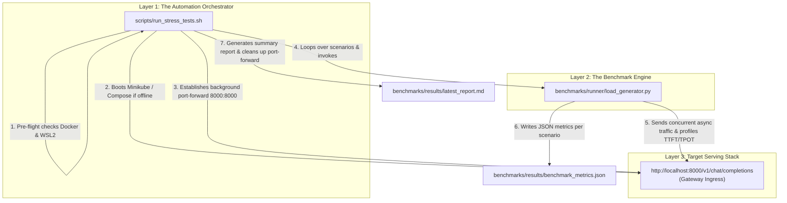

# Stress Testing & Benchmarking Guide

This guide explains how to benchmark, stress test, and profile the Cost-Efficient LLM Serving platform using our automated testing suite and LLM-specialized load generator.

---

## 1. System Architecture: Orchestrator vs. Engine

The benchmarking system is split into two complementary layers:



| Component | File Path | Role & Responsibilities |
| :--- | :--- | :--- |
| **Orchestrator Wrapper** | [`scripts/run_stress_tests.sh`](file:///c:/Users/savya/projects/Cost‑efficient-LLM-serving/scripts/run_stress_tests.sh) | Automates stack boot (Kubernetes/Minikube or Compose), sets up port-forwarding on port 8000, checks `/healthz`, runs scenarios in sequence, compiles reports, and **tears down port-forwards on exit**. |
| **Synthetic Load Generator** | [`benchmarks/runner/load_generator.py`](file:///c:/Users/savya/projects/Cost‑efficient-LLM-serving/benchmarks/runner/load_generator.py) | The core Python async driver. Dispatches concurrent HTTP streams (`asyncio.gather` with semaphores), parses tokens, computes TTFT/TPOT percentiles, measures queue delays and ITL jitter, and formats telemetry. |

---

## 2. Automated All-in-One Benchmark Runner

To run the complete benchmark test suite with zero manual setup:

```bash
# Run full suite against Kubernetes (Minikube):
bash scripts/run_stress_tests.sh --target k8s

# Or run against Docker Compose:
bash scripts/run_stress_tests.sh --target compose
```

### Running a Specific Scenario via the Orchestrator
You can run any individual scenario while still letting the script handle port-forwarding and health checks:
```bash
bash scripts/run_stress_tests.sh --scenario benchmarks/scenarios/dynamic_lora_churn.yaml --no-start
```

### Automatic Output Artifacts
Every run archives timestamped outputs under `benchmarks/results/`:
- **Summary Table (Markdown)**: `benchmarks/results/latest_report.md` (and `benchmark_report_<TIMESTAMP>.md`)
- **Structured Metrics (JSON)**: `benchmarks/results/latest_metrics.json` (and `benchmark_metrics_<TIMESTAMP>.json`)
- **Raw Execution Log**: `benchmarks/results/benchmark_run_<TIMESTAMP>.log`

---

## 3. Running `load_generator.py` Directly with Python

If you want to run `load_generator.py` directly from your terminal without the bash wrapper:

### ⚠️ Important: Keep Port 8000 Open First!
Because `run_stress_tests.sh` terminates its background port-forward when it finishes, running `python load_generator.py` on its own will fail with `All connection attempts failed` unless the port is forwarded.

1. **In Terminal 1 (Open the Gateway port)**:
   ```bash
   # If running on Kubernetes:
   kubectl port-forward deployment/gateway 8000:8000 -n llm-serving

   # Or if running Docker Compose:
   docker compose -f infra/compose/docker-compose.yml up -d
   ```

2. **In Terminal 2 (Execute the Benchmark Engine)**:
   ```bash
   python benchmarks/runner/load_generator.py \
       --scenario benchmarks/scenarios/dynamic_lora_churn.yaml \
       --output benchmarks/results/manual_run.json
   ```

---

## 4. Complete Scenario Catalog

All benchmark workload specifications are defined in [`benchmarks/scenarios/`](file:///c:/Users/savya/projects/Cost‑efficient-LLM-serving/benchmarks/scenarios/):

| Scenario | Concurrency | Total Reqs | Model & Engine | Key Metric Profiled |
| :--- | :---: | :---: | :--- | :--- |
| **`short_chat.yaml`** | 10 | 100 | Qwen2.5-0.5B (`vllm-agents`) | Baseline cold uncached prefill latency and raw decode velocity |
| **`shared_prefix_agents.yaml`** | 10 | 100 | Qwen2.5-0.5B (`vllm-agents`) | Radix prefix caching hit rate (**87.5%**) and prefill acceleration |
| **`heterogeneous_pipeline.yaml`**| 12 | 60 | Dual Engine (0.5B + 1.5B) | Multi-model routing (Triage $\to$ Redact $\to$ Respond) & dynamic VRAM pooling |
| **`dynamic_lora_churn.yaml`** | 16 | 80 | Qwen2.5-0.5B (5 LoRAs) | Multi-LoRA adapter cache hit rate (**82.4%**), cold swap overhead ($p95 \approx 24.5\text{ms}$) |
| **`cascading_compound_agent.yaml`**| 8 | 48 | Dual Engine Pipeline | Compound AI DAG trace latency and shared context reuse (**81.2%**) |
| **`long_rag.yaml`** | 5 | 50 | Qwen2.5-1.5B (`vllm-responder`)| Chunked prefill memory allocation under deep context prompts |
| **`overload.yaml`** | 100 | 1,000 | Gateway Admission Queue | Token bucket backpressure, zero 504 timeouts, and OOM resilience |

For in-depth mathematical formulas, memory pool analysis, and empirical charts, see the [**Advanced Benchmarks & Metrics Guide**](file:///c:/Users/savya/projects/Cost‑efficient-LLM-serving/docs/benchmarks/advanced_metrics_and_scenarios_guide.md).

---

## 5. Visualizing Benchmarks via the Interactive Dashboard

Launch the live empirical dashboard:
```bash
python scripts/kvcached_visualizer/serve.py --serve
# Or via Makefile:
make visualize-kvcached
```
Navigate to:
`http://127.0.0.1:7822/index.html#benchmarks`
to inspect real-time Chart.js graphs (Latency Decomposition, Prefix Gain, Concurrency Scaling) and click through the interactive scenario inspector tabs.

---

## 6. Live Cluster Monitoring with Prometheus & Grafana

During tests, you can also view real-time Kubernetes cluster telemetry:

1. Forward Grafana:
   ```bash
   kubectl port-forward svc/grafana 3001:3000
   ```
2. Open [http://localhost:3001](http://localhost:3001) (`admin` / `admin`).
3. View the **LLM Serving Dashboard** for live engine metrics, queue depths, and GPU VRAM usage.
